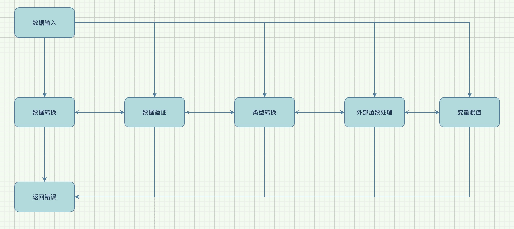

# optional
随意的处理数据

### 数据处理模型

- value
- processor
- validator
- align

### 设计思路

- value和type存储数据类型和值，附加函数处理数据类型转换。
- processor处理数据
- validator验证数据
- align反射赋值到指定字段

### 扩展功能
- 类型与值： 添加多个数据来源接口，添加json序列化实现，添加国际化错误返回接口
- 处理器： 完善更多的处理器函数，添加自定义处理器接口，优化处理器执行
- 验证器：完善更多的验证起函数，添加自定义验证起接口，优化验证逻辑
- 赋值： 完善反射赋值，添加多种赋值方式。

友情链接
- go-cty: [https://github.com/zclconf/go-cty](https://github.com/zclconf/go-cty)
- filter: [https://github.com/dxvgef/filter](https://github.com/dxvgef/filter)
